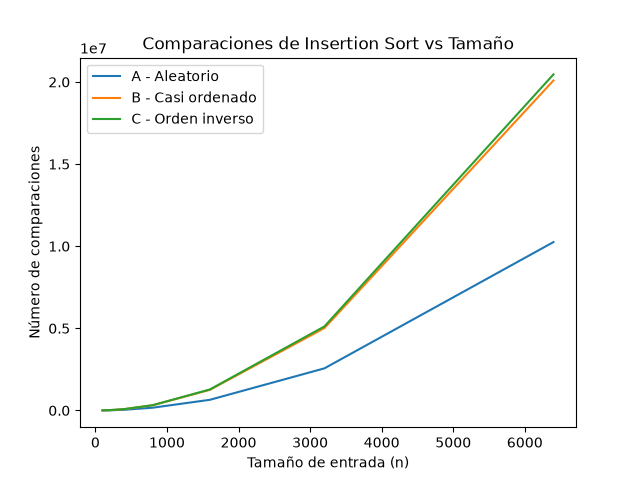
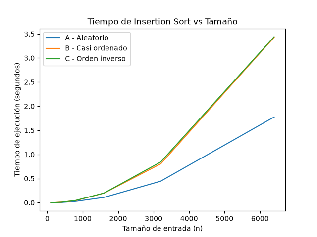
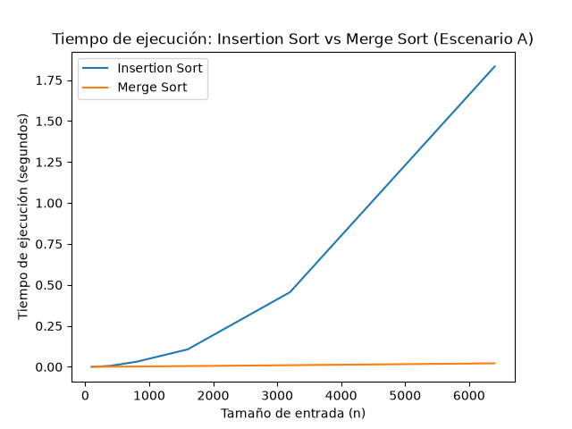

# Laboratorio 1 - Fundamentos de Complejidad y Recurrencias

**Nombre completo:** [Santiago Stiven Gomez Montoya ]
**Curso:** Análisis de Algoritmos

## Instrucciones para reproducir el experimento

1. Activar el entorno virtual: `..\..\venv\Scripts\activate`
2. Ejecutar la Parte 3: `python parte3_casos.py`
3. Ejecutar la Parte 4: `python parte4_complejidad.py`
4. Las gráficas se generan automáticamente en la carpeta `graficas/`.

---

## Parte 1 - Análisis del algoritmo vs. hardware

Aunque Insertion Sort funciona y ordena bien los datos, el problema es que con tanta información se vuelve muy lento. Tenemos una ventana de solo 4 horas, de 2 a.m. a 6 a.m., y el proceso no alcanza a terminar a tiempo.

Además, Insertion Sort tiene una complejidad O(n²), por eso poner un servidor más potente no soluciona realmente el problema. Puede ayudar un poco, pero el problema principal sigue siendo el algoritmo.

Un ejemplo sería una aplicación de mapas: puede encontrar la ruta correcta, pero si se demora demasiado en mostrarla, deja de ser útil para el usuario.

---

## Parte 2 - Responsabilidad ambiental y ética

El proceso corre todas las madrugadas y eso también tiene un impacto ambiental, porque el computador consume energía durante todo ese tiempo. Si lo hacemos todos los días durante años, ese consumo termina siendo bastante grande.

También hay un tema ético. Si la lista no termina a tiempo, un paciente de alto riesgo podría no recibir la llamada cuando la necesita. Además, el operador tendría que trabajar con una lista incompleta, lo que puede generar confusión y estrés.

Por eso no solo importa que el algoritmo sea rápido, sino que también ordene correctamente la lista, porque el orden determina a qué pacientes se llama primero y un error podría tener consecuencias graves.

---

## Parte 3 - Casos de análisis y experimentación

### Predicción inicial (3.1)
Antes de hacer las pruebas, pensé que el escenario C, que es el de orden inverso, iba a ser el más lento para Insertion Sort, porque tiene que hacer muchos movimientos. En cambio, el escenario B, que está casi ordenado, debería ser el más rápido porque casi no necesita mover los elementos. Y el escenario A, que es aleatorio, quedaría más o menos en el medio.

### Gráficas

### Análisis de resultados (3.2)

Al ver las gráficas, se confirmó que el escenario C, que es el de orden inverso, fue el que más tiempo y comparaciones necesitó. El escenario A, que es aleatorio, fue el que menos consumió.

Esto coincide con lo que había pensado al principio, porque en el orden inverso cada elemento tiene que moverse bastante. Lo que me sorprendió fue el escenario B, porque aunque está casi ordenado, ese pequeño porcentaje de elementos desordenados hizo que el algoritmo tuviera que hacer muchos movimientos.

---

## Parte 4 - Complejidad y comparación de algoritmos

### Cálculo de recurrencias (4.1)

“En Insertion Sort, en el peor caso la recurrencia se puede expresar como T(n) = T(n-1) + O(n). Esto pasa porque el algoritmo va tomando cada elemento y lo compara con los anteriores hasta encontrar su posición.

Si hacemos esto con todos los elementos, el número de operaciones va creciendo bastante. Por eso, en el peor caso, la complejidad de Insertion Sort es O(n²).

En pocas palabras, mientras más datos tengamos, mucho más tiempo va a necesitar el algoritmo.”

### Tabla de complejidades

| Algoritmo | Mejor caso | Caso promedio | Peor caso |
|-----------|------------|---------------|-----------|
| Insertion Sort | O(n) | O(n²) | O(n²) |
| Merge Sort | O(n log n) | O(n log n) | O(n log n) |

### Gráfica comparativa

### Conclusión (4.2)

En la gráfica se nota claramente que Insertion Sort empieza a tardar mucho más cuando aumentan los datos, mientras que Merge Sort se mantiene mucho más estable.

Esto demuestra que Merge Sort es más eficiente para grandes cantidades de información. En el caso de Tamiza, que trabaja con 1.200.000 registros, Insertion Sort no sería una opción práctica, porque podría tardar demasiado. Esto también coincide con lo que vimos antes: O(n²) para Insertion Sort frente a O(n log n) para Merge Sort.

### Concepto técnico (4.3)

Yo recomendaría usar Merge Sort en Tamiza. Aunque Insertion Sort funciona, con 1.200.000 registros se vuelve demasiado lento por su complejidad O(n²).

Merge Sort es mucho más eficiente y permite manejar grandes cantidades de datos en menos tiempo. Por eso, en lugar de invertir primero en un servidor más potente, sería mejor cambiar el algoritmo, ya que el problema principal está en la forma de procesar los datos y no en el hardware.